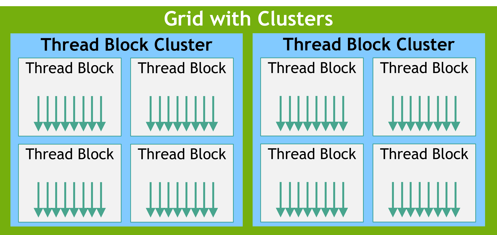

# Programming Guide

[cuda编程初步入门指导](https://docs.nvidia.com/cuda/archive/12.3.1/cuda-c-programming-guide/index.html)


这个图说的是cpu和gpu的架构差异，侧重点，cpu很多面积用在了缓存和控制上，gpu则强调计算能力，大部分面积用在计算核心上。cpu的多层存储架构和逻辑单元保障通用软件的灵活性。

gpu天生的特点(为绘制图形设计)就是大数据，并行计算能力；


cuda是一个**可伸缩**的编程模型，也就是说thread block可以被安排到任一stream multiprocessor去运行，这个任务规划可以放在运行时，根据当前硬件自动匹配。

## Programming Model编程模型

### kernels核函数`__global__`函数

使用cpp定义，但是运行在gpu上的带cuda扩展语法的函数；

```c++
// Kernel 函数定义，__global__是cuda的扩展
__global__ void VecAdd(float* A, float* B, float* C)
{
    int i = threadIdx.x; //threadIdx是cuda内置关键字，表示当前thread在block中的索引
    C[i] = A[i] + B[i];
}

int main()
{
    ...
    // <<<1, N>>>也是cuda的扩展，里面的数字分别表示grid dim, block dim
    VecAdd<<<1, N>>>(A, B, C);
    ...
}
```

### Thread Hierarchy(层级)

计算当前thread的索引的时候，需要看gridDim, blockIdx， blockDim, threadIdx，

```c++
// Kernel 定义
__global__ void MatAdd(float A[N][N], float B[N][N],
                       float C[N][N])
{
    int i = threadIdx.x; //__globa__ kernel定义的blockDim是二维的
    int j = threadIdx.y;
    C[i][j] = A[i][j] + B[i][j];
}

int main()
{
    ...
    // 1 个block，block内部包含 N * N * 1 个threads
    int numBlocks = 1; //
    dim3 threadsPerBlock(N, N); //blockDim 二维
    MatAdd<<<numBlocks, threadsPerBlock>>>(A, B, C);
    ...
}
```

上面通过你的kernel函数传入的gridDim, blockDim是需要根据任务量进行计算的。


每个block包含的thread数量是有限制的，比如gtx1650，7个stream multiprocessor，每个sm包含128个cuda core。虽然只有128个core，但是每个block可以最大支持1024个thread。

**thread block只能在一个sm上执行**，不能跨sm；

thread blocks被规划到sm上，可能是串行也可能是并行，所以thread block之间是一个独立的状态，只有在block内部的thread才具备通讯，协作的可能。比如通过shared memeory共享数据，或者设置同步点(调用`__syncthread()`)来协调运行逻辑。

#### Thread Block Clusters



目前最新的rtx 4090 compute capability=8.9，不支持；像gtx 1650使用的turing架构，compute capability=7.5；

[compute capability查询](https://developer.nvidia.com/cuda-gpus)

**Compute Capability 9.0**开始引入了这个概念，cluster 内的thread blocks 会被保证安排到同一个GPU Processing Cluster (GPC)。

cluster的dim也可以是一维，二维或者三维。通常8个thread block是一个移植性较好的值，但是对于一些sm小于8的gpu来说，这个数值应该进一步减小。`cudaOccupancyMaxPotentialClusterSize`去查询这个最大值。

使用这个特性的时候，有如下两种方式：

- kernel函数增加`__cluster_dims__`修饰
- 使用`cudaLaunchKernelEx`调用kernel函数，需要传递一个`cudaLaunchConfig_t`参数。

cluster内部的thread可以访问这个cluster内部的所有block的shared memory：

### Memory Hierarchy（层级）

1. thread -> local memory 

2. thread block -> shared memory， 生命周期等同于block

3. cluster -> multi block shared memory
4. all thread -> global memory


### Heterogeneous Programming（异构编程）

异构编程模型，分为host, device部分，他们之间有各自的memory space，通常是不可直接访问对方的memory；cuda的runtime api负责管理global, constant, texture等gpu memory，也负责在host, device之间传送数据，而c++语言里面的api直接管理host也就是cpu的memory。

__Unified Memory__提供managed memory来桥接host和device的memory空间，managed memory可以被所有的cpu, gpu访问，且访问地址是一致的。这个方式扩展了gpu memory，隐藏了显式的在cpu gpu之间同步数据，并且简化了程序移植工作。


### Asynchronous SIMT Programming Model(异步SIMT编程模型)

从Ampere架构开始，cuda通过异步SIMT编程模型提供加速内存操作；异步SIMT编程模型为对应的cuda thread定义了对应的异步操作；

异步SIMT编程模型为cuda threads定义了异步barrier的具体行为；

cuda异步操作指的是一个cuda thread初始化数据，然后交给令一个cuda thread执行，在一个组织良好的程序中，一个或者更多个thread使用异步操作，然后在某个地方进行(阻塞)同步。

异步thread总是和初始化异步操作的thread关联，异步操作一般使用synchronization object 来同步操作结束。synchronization object 可以显式的由用户管理或者隐式的由library管理。

synchronization object可以是`cuda::barrier` 或者`cuda::pipeline`，synchronization object可以在不同的thread作用域使用，如下是定义：

| thread scope                            | 含义                               |
| --------------------------------------- | ---------------------------------- |
| cuda::thread_scope::thread_scope_thread | 只有初始化异步操作的thread进行同步 |
| cuda::thread_scope::thread_scope_block  | 同一thread block内的thread都同步   |
| cuda::thread_scope::thread_scope_device | 同一gpu上的thread都同步            |
| cuda::thread_scope::thread_scope_system | 同一系统上的gpu thread都同步       |

### Compute Capability

也叫SM version

gtx 1650使用的turing架构，compute capability=7.5；

[compute capability查询](https://developer.nvidia.com/cuda-gpus)

*Hopper GPU* architecture = SM9

Ampere GPU architecture = SM8

*Turing* GPU architecture  = SM7.5

*Volta GPU* architecture = SM7

*Pascal* architecture = SM6

*Maxwell* architecture = SM5

 *Kepler* architecture = SM3

## Programming Interface

cuda c++包含一个规模很小的语法扩展和一个runtime库；任何带有语法扩展的源文件都必须使用nvcc编译；

runtime库包含了：

- 用于打开关闭gpu设备，cpu执行的函数
- 在cpu, gpu之间传输数据的函数
- 管理多gpu的系统函数

runtime库建立在底层c函数和cuda驱动api之上，这些函数也可以被应用程序访问到；

驱动程序应用程序接口通过公开 CUDA context（类似于device的host处理）和 CUDA 模块（类似于device的动态加载库）等低级概念，提供额外的控制级别。

大部分情况下应用都不需要cuda 驱动api，这种情况下写代码更简洁。同时在需要的时候也可以访问使用驱动api。

### nvcc编译

kernel函数可以使用cuda特定架构指令集(PTX)编写，但通常更高层的c++更容易编写。

high-level的c++代码需要使用nvcc编译处理生成binary code。

#### 离线编译

nvcc能够编译host code和device code的混合代码文件，首先分离device code出来然后：

- 把device code编译为汇编PTX代码或者binary文件
- 修改host code，把`<<<...>>>`扩展的kernel函数替换为cuda runtime函数，从PTX或者binary加载调用编译好的kernel函数

修改后的host code将使用另一个编译器编译，或者让nvcc在编译最后阶段调用host编译器去编译；

application然后就可以链接到编译后的host code，生成可执行文件（大部分情况下都是这样）；或者可以使用cuda驱动api执行PTX或者binary文件。

#### JIT编译

前面我们提到过application可以通过cuda 驱动api加载PTX代码，在运行时阶段PTX代码会被进一步编译成binary，这就是just-in-time编译；JIT编译减慢了加载速度，但可以让程序从更新驱动，编译器之后获利；

设想这样的情况，开发编译阶段你的device型号是A，但是你的程序将来要分发到device 型号B的机器上，JIT通常也是唯一的一条路；

device驱动JIT编译PTX代码通常会生成一个cache，用来避免重复编译，当device 驱动更新之后，这个cache也将失效，这样就能通过更新驱动的方式提升性能。

#### 二进制兼容

二进制代码是和架构绑定的，nvcc使用`-code=sm_75`选项指定，sm_75表示为compute capability = 7.5的gpu生成二进制程序，最简单的兼容规则是， `-code=sm_75`生成的二进制程序可以运行在compute capability >= 7.5的gpu上；但反过来不行；

#### PTX兼容

nvcc的`-arch=compute_75`选项用来指定当编译c++代码到PTX代码时的compute capability版本，因为某些PTX指令只有在高版本compute capability才支持，所以如果你的c++代码包含某些高版本的compute capability才支持的指令，就必须显式地指定该选项。

指定-arch的PTX代码通常都可以编译到对应或者更高版本sm的二进制程序；注意，从低版本compute capability编译而来的PTX代码可能没有用到最新的硬件特性，比如从-arch=compute_60生成的PTX代码，然后编译到-code=sm_70的二进制程序，就不会用到Tensor Core的指令；

#### Application兼容

要在一个特定的compute capability的gpu上执行，这个程序必须从二进制代码加载或者JIT编译PTX代码，相应的二进制或者PTX兼容需要满足要求；如果要让这个程序可以在将来更高版本的compute capability gpu上执行，则必须使用程序加载JIT编译PTX的方式进行；

在程序内部嵌入PTX和二进制代码的方式是使用`-gencode`的`arch`和`code`子选项：

```bash
nvcc x.cu
        -gencode arch=compute_50,code=sm_50
        -gencode arch=compute_60,code=sm_60
        -gencode arch=compute_70,code=\"compute_70,sm_70\"
```

这个例子里面前两个-gencode嵌入sm_50, sm_60两种二进制代码，第三个-gencode嵌入sm_70的PTX和二进制代码；

cpu侧在运行时自动根据当前compute capability 版本选择最近的gpu 代码执行；

比如-code=sm_50生成的二进制代码会在compute capability=5.0, 5.2的gpu上执行，-code=sm_60生成的二进制代码会在compute capability=6.0, 6.1的gpu上执行，-code=sm_70生成的二进制代码会在compute capability=7.0, 7.5的gpu上执行，内嵌的PTX代码可以在compute capability=8.0, 8.6的gpu上JIT编译执行；

nvcc通过`-arch`指定`__CUDA_ARCH__`宏，从而可以在device代码中根据arch版本写不同的代码实现；

`arch=compute_80` 指定的 `__CUDA_ARCH__`=`800`；

如果直接使用驱动API，则必须编译到不同的文件，在运行时自行指定启动哪个文件；

Volta架构引入了*Independent Thread Scheduling*来改变gpu的thread映射，如果要强制使用之前版本的SIMT scheduling，则可以使用`-arch=compute_60 -code=sm_70`

`-arch=sm_70` 是 `-arch=compute_70 -code=compute_70,sm_70` 的简写，同时也等价于 `-gencode arch=compute_70,code=\"compute_70,sm_70\"`

#### C++兼容

host代码是完全兼容标准c++的，device代码则使用c++的一个子集；

#### x64兼容

64bit的nvcc在64bit模式下编译device代码，指针size是64 bit，64bit模式下编译的device 代码要求host端也要是64bit模式；

### CUDA runtime

静态库：cudart.a或者cudart.lib，动态库：cudart.so或者cudart.dll, 里面所有的接口都有前缀cuda;

