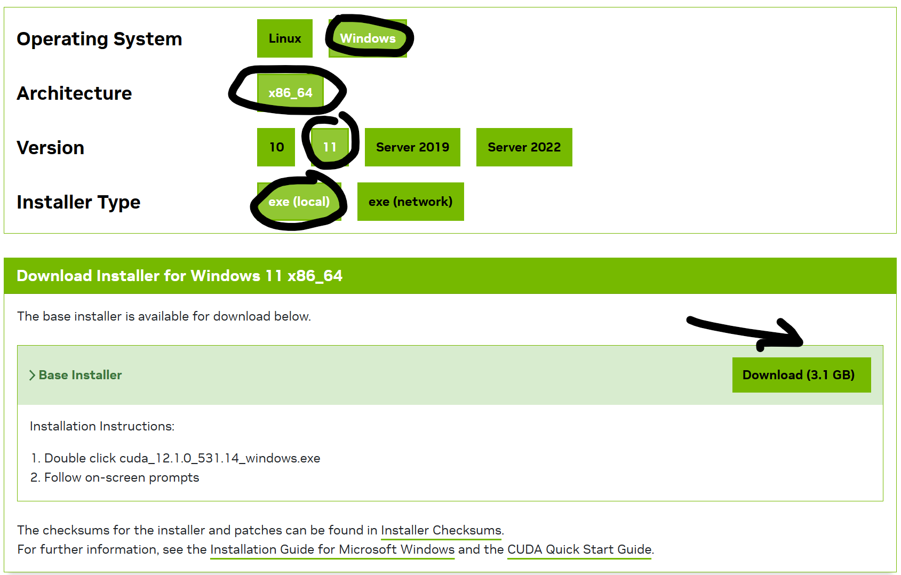
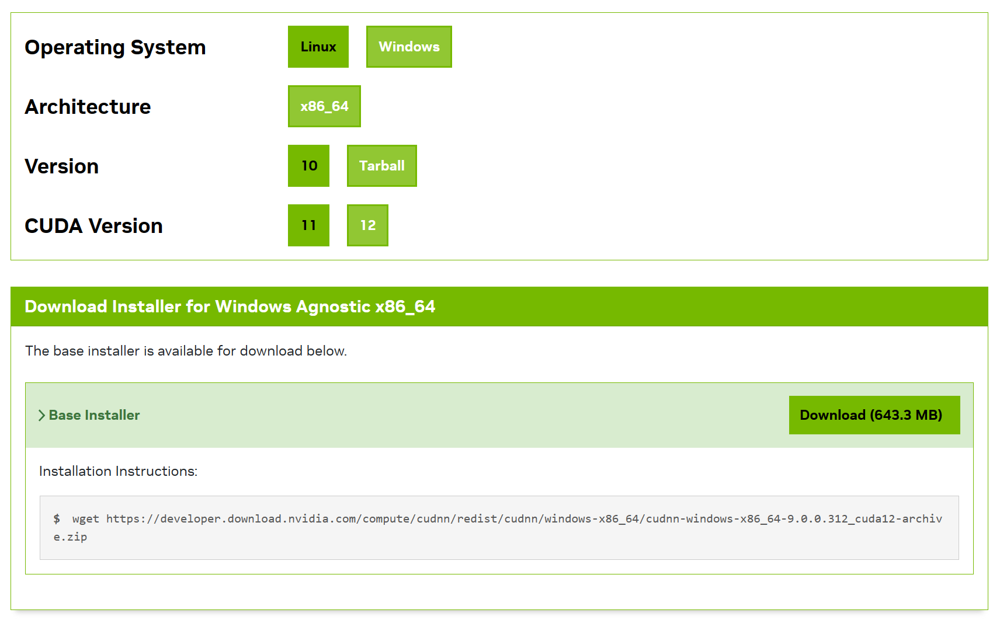

# 安装CUDA(windows 11)

[CUDA12.1版本下载页面](https://developer.nvidia.com/cuda-12-1-0-download-archive?target_os=Windows&target_arch=x86_64&target_version=11&target_type=exe_local)

# 安装cuDNN

[cuDNN下载页面](https://developer.nvidia.com/cudnn-downloads?target_os=Windows&target_arch=x86_64&target_version=Agnostic&cuda_version=12)

[安装指导](https://docs.nvidia.com/deeplearning/cudnn/installation/windows.html#installing-on-windows)